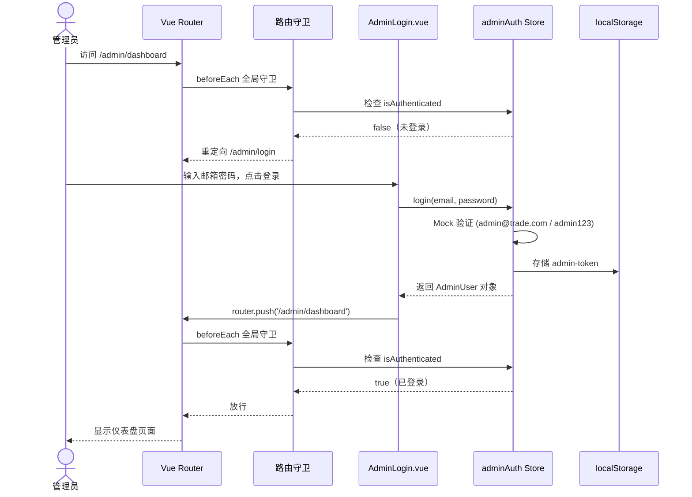
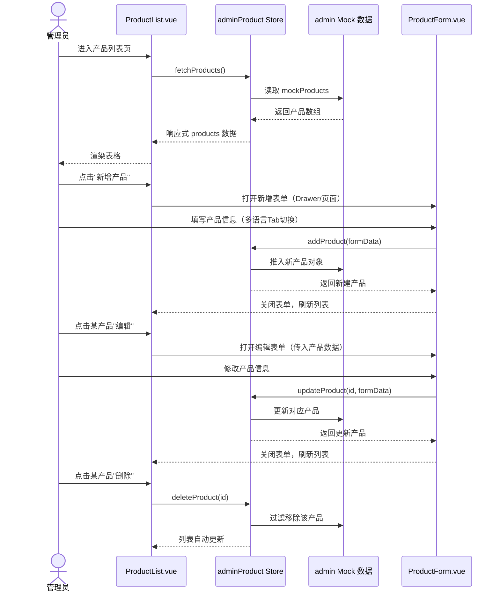
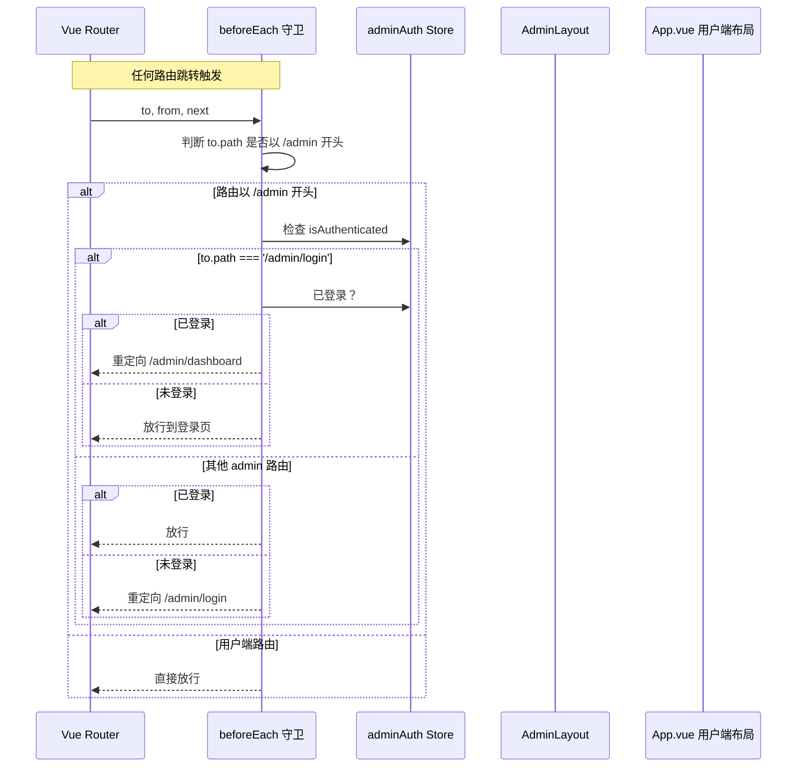
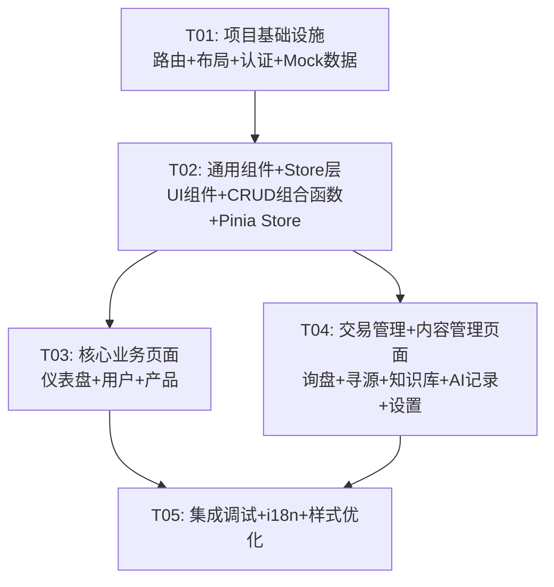

# 后台管理系统 — 系统架构设计 + 任务分解

> 架构师：高见远（Gao） | 基于 PRD v1.0 | 技术栈：Vue 3 + Vite + Tailwind CSS

---

## 1. 实现方案 + 框架选型

### 1.1 核心技术挑战

| 挑战 | 说明 | 解决方案 |
|------|------|---------|
| 布局隔离 | /admin 路由下不加载用户端 Navbar/Footer/AIChat/FloatingContact | 使用独立 AdminLayout 组件，通过路由 meta + 嵌套路由实现布局切换 |
| 路由守卫 | 未登录管理员不能访问后台页面 | 全局前置守卫 + meta.requiresAdmin 标记，独立 adminAuth store |
| 数据 Mock | 无后端，所有 CRUD 操作在本地完成 | 在 admin Mock 数据模块中实现完整的数据操作方法，Pinia store 调用 |
| 多语言内容编辑 | 产品/FAQ/公司信息需编辑四语字段 | 复用现有 i18n locale 列表，封装 MultilangInput 通用组件 |
| 图表渲染 | 仪表盘需要折线图/饼图 | 引入 chart.js + vue-chartjs 轻量方案 |

### 1.2 框架与库选型

| 类别 | 选型 | 理由 |
|------|------|------|
| 图表 | chart.js@4 + vue-chartjs@5 | 轻量（~65KB gzip），Vue 3 原生支持，覆盖折线图/饼图/柱状图 |
| 日期处理 | dayjs | 轻量（~2KB），替代 moment，用于日期范围筛选和格式化 |
| 现有依赖复用 | radix-vue | 已安装，用于 Dialog/Drawer/DropdownMenu/Tabs/Select 等无样式原语 |
| 现有依赖复用 | lucide-vue-next | 已安装，用于后台所有图标 |
| 现有依赖复用 | @vueuse/core | 已安装，用于 useLocalStorage、useDebounce 等工具函数 |

**不新增重量级 UI 框架**（Element Plus / Naive UI 等），所有后台组件基于 Tailwind CSS + radix-vue 手写。

### 1.3 后台嵌入现有项目方案

```
项目路由结构：
/                    → 用户端（App.vue 布局：Navbar + Footer + AIChat + FloatingContact）
/admin/login         → 管理员登录页（无布局壳）
/admin               → AdminLayout（侧边栏 + 顶栏，无用户端组件）
  /admin/dashboard
  /admin/users
  /admin/products
  /admin/products/new
  /admin/products/:id/edit
  /admin/categories
  /admin/certifications
  /admin/inquiries
  /admin/inquiries/:id
  /admin/sourcing
  /admin/sourcing/:id
  /admin/knowledge
  /admin/ai-chat
  /admin/settings
```

**布局隔离策略**：

1. `App.vue` 通过 `route.meta.layout` 判断当前路由属于哪个布局
2. 当 `meta.layout === 'admin'` 时，渲染 `AdminLayout` 而非用户端布局
3. `AdminLayout` 内部包含 `AdminSidebar` + `AdminHeader` + `<router-view />`
4. 登录页 `meta.layout === 'admin-auth'`，无侧边栏/顶栏

**代码边界与共享策略**：

| 共享内容 | 方式 | 说明 |
|---------|------|------|
| Tailwind 色系 | 直接复用 | beike-primary/bg/heading/border 等 |
| Mock 产品数据 | import 引用 | 后台只读引用 products/categories/certifications，修改操作在 admin store 中进行 |
| i18n 配置 | 扩展 | 在现有 i18n 中新增 admin 命名空间的翻译 key |
| 图标库 | 直接复用 | lucide-vue-next |
| radix-vue | 直接复用 | 后台大量使用 Dialog/Drawer/Tabs/Select 等原语 |

---

## 2. 文件列表及相对路径

### 2.1 新增文件

```
src/
├── admin/
│   ├── layouts/
│   │   └── AdminLayout.vue              # 后台主布局（侧边栏+顶栏+内容区）
│   ├── components/
│   │   ├── AdminSidebar.vue             # 侧边栏导航（可折叠、移动端抽屉）
│   │   ├── AdminHeader.vue              # 顶部栏（面包屑+语言切换+管理员信息+登出）
│   │   ├── StatsCard.vue                # 仪表盘统计卡片组件
│   │   ├── DataTable.vue                # 通用数据表格组件（分页+排序+选择）
│   │   ├── SearchBar.vue                # 通用搜索+筛选栏组件
│   │   ├── Pagination.vue               # 通用分页器组件
│   │   ├── StatusBadge.vue              # 状态标签组件（询盘/寻源状态）
│   │   ├── MultilangInput.vue           # 多语言输入组件（Tab切换中英韩日）
│   │   ├── ConfirmDialog.vue            # 确认弹窗组件
│   │   ├── EmptyState.vue               # 空状态占位组件
│   │   └── ChartWrapper.vue             # 图表容器组件（封装 vue-chartjs）
│   ├── views/
│   │   ├── AdminLogin.vue               # 登录页
│   │   ├── Dashboard.vue                # 仪表盘
│   │   ├── UserList.vue                 # 用户管理列表
│   │   ├── UserDetail.vue               # 用户详情抽屉
│   │   ├── ProductList.vue              # 产品列表
│   │   ├── ProductForm.vue              # 产品新增/编辑表单
│   │   ├── CategoryManager.vue          # 分类管理
│   │   ├── CertificationManager.vue     # 认证管理
│   │   ├── InquiryList.vue              # 询盘列表
│   │   ├── InquiryDetail.vue            # 询盘详情
│   │   ├── SourcingList.vue             # 寻源列表
│   │   ├── SourcingDetail.vue           # 寻源详情
│   │   ├── KnowledgeList.vue            # 知识库列表
│   │   ├── KnowledgeForm.vue            # FAQ 新增/编辑
│   │   ├── AiChatRecords.vue            # AI 聊天记录
│   │   └── Settings.vue                 # 系统设置
│   └── composables/
│       ├── useAdminAuth.js              # 管理员认证组合式函数
│       └── useCrudList.js               # 通用列表 CRUD 组合式函数（搜索/分页/排序）
├── stores/
│   ├── adminAuth.js                     # 【新增】管理员认证 Store
│   ├── adminProduct.js                  # 【新增】后台产品管理 Store
│   ├── adminInquiry.js                  # 【新增】后台询盘管理 Store
│   ├── adminSourcing.js                 # 【新增】后台寻源管理 Store
│   └── adminSettings.js                 # 【新增】后台设置 Store
├── assets/
│   └── mock/
│       └── admin.js                     # 【新增】后台 Mock 数据（用户列表、询盘、寻源、聊天记录等）
```

### 2.2 修改文件

```
src/
├── router/index.js                      # 【修改】新增 /admin 路由组和路由守卫
├── App.vue                              # 【修改】根据 meta.layout 切换布局
├── i18n/
│   ├── zh.js                            # 【修改】新增 admin 命名空间翻译
│   ├── en.js                            # 【修改】新增 admin 命名空间翻译
│   ├── ko.js                            # 【修改】新增 admin 命名空间翻译
│   └── ja.js                            # 【修改】新增 admin 命名空间翻译
```

---

## 3. 数据结构和接口（类图）

```mermaid
classDiagram
    direction TB

    class AdminAuthStore {
        +admin: AdminUser | null
        +isAuthenticated: boolean
        +login(email, password) Promise
        +logout() void
        +checkAuth() void
    }

    class AdminUser {
        +id: string
        +name: string
        +email: string
        +role: string
        +avatar: string
    }

    class AdminProductStore {
        +products: Product[]
        +categories: Category[]
        +certifications: Certification[]
        +loading: boolean
        +fetchProducts() void
        +addProduct(data) Product
        +updateProduct(id, data) Product
        +deleteProduct(id) void
        +addCategory(data) Category
        +updateCategory(id, data) Category
        +deleteCategory(id) void
        +addCertification(data) Certification
        +updateCertification(id, data) Certification
        +deleteCertification(id) void
    }

    class Product {
        +id: string
        +name_cn: string
        +name_en: string
        +name_ko: string
        +name_ja: string
        +category: string
        +image: string
        +images: string[]
        +specs: Record~string,string~
        +moq: string
        +certifications: string[]
        +packaging: string
        +lead_time: string
        +description_cn: string
        +description_en: string
        +description_ko: string
        +description_ja: string
        +features: string[]
        +status: string
        +createdAt: string
        +updatedAt: string
    }

    class Category {
        +id: string
        +key: string
        +icon: string
        +name_cn: string
        +name_en: string
        +name_ko: string
        +name_ja: string
        +sortOrder: number
    }

    class Certification {
        +id: string
        +code: string
        +name: string
        +icon: string
    }

    class AdminInquiryStore {
        +inquiries: Inquiry[]
        +loading: boolean
        +fetchInquiries() void
        +getInquiry(id) Inquiry
        +updateStatus(id, status) Inquiry
        +addNote(id, content) Note
        +addReply(id, content) Reply
    }

    class Inquiry {
        +id: string
        +productId: string
        +productName: string
        +customer: CustomerInfo
        +message: string
        +status: string
        +notes: Note[]
        +replies: Reply[]
        +createdAt: string
        +updatedAt: string
    }

    class Note {
        +id: string
        +content: string
        +author: string
        +createdAt: string
    }

    class Reply {
        +id: string
        +content: string
        +sentAt: string
    }

    class CustomerInfo {
        +name: string
        +email: string
        +company: string
        +country: string
    }

    class AdminSourcingStore {
        +requests: SourcingRequest[]
        +loading: boolean
        +fetchRequests() void
        +getRequest(id) SourcingRequest
        +updateStatus(id, status) SourcingRequest
        +addQuote(id, quote) SourcingRequest
    }

    class SourcingRequest {
        +id: string
        +title: string
        +description: string
        +customer: CustomerInfo
        +status: string
        +quote: Quote | null
        +createdAt: string
        +updatedAt: string
    }

    class Quote {
        +price: number
        +currency: string
        +leadTime: string
        +notes: string
        +quotedAt: string
    }

    class AdminSettingsStore {
        +companyInfo: CompanyInfo
        +languages: LanguageConfig[]
        +updateCompanyInfo(data) void
        +toggleLanguage(code, enabled) void
        +setDefaultLanguage(code) void
    }

    class CompanyInfo {
        +name_cn: string
        +name_en: string
        +name_ko: string
        +name_ja: string
        +founded: number
        +employees: string
        +annualRevenue: string
        +headquarters_cn: string
        +headquarters_en: string
        +serviceCountries: number
        +totalClients: number
        +totalProducts: number
    }

    class LanguageConfig {
        +code: string
        +name: string
        +enabled: boolean
        +isDefault: boolean
    }

    class MockUser {
        +id: string
        +name: string
        +email: string
        +company: string
        +country: string
        +avatar: string
        +status: string
        +createdAt: string
    }

    class ChatRecord {
        +userId: string
        +userName: string
        +messages: ChatMessage[]
    }

    class ChatMessage {
        +id: string
        +role: string
        +content: string
        +timestamp: string
    }

    class FAQItem {
        +id: string
        +q_cn: string
        +q_en: string
        +q_ko: string
        +q_ja: string
        +a_cn: string
        +a_en: string
        +a_ko: string
        +a_ja: string
        +tags: string[]
    }

    AdminAuthStore --> AdminUser : manages
    AdminProductStore --> Product : manages
    AdminProductStore --> Category : manages
    AdminProductStore --> Certification : manages
    AdminInquiryStore --> Inquiry : manages
    Inquiry --> CustomerInfo : contains
    Inquiry --> Note : has many
    Inquiry --> Reply : has many
    AdminSourcingStore --> SourcingRequest : manages
    SourcingRequest --> CustomerInfo : contains
    SourcingRequest --> Quote : may have
    AdminSettingsStore --> CompanyInfo : manages
    AdminSettingsStore --> LanguageConfig : manages
```



---

## 4. 程序调用流程（时序图）

### 4.1 管理员登录流程



### 4.2 数据 CRUD 流程（以产品管理为例）



### 4.3 路由守卫流程



---

## 5. 任务列表

### T01: 项目基础设施（路由+布局+认证+Mock 数据层）

| 字段 | 内容 |
|------|------|
| **任务名称** | 项目基础设施 |
| **依赖任务** | 无 |
| **优先级** | P0 |
| **涉及文件** | `src/router/index.js`（修改）, `src/App.vue`（修改）, `src/admin/layouts/AdminLayout.vue`（新增）, `src/admin/components/AdminSidebar.vue`（新增）, `src/admin/components/AdminHeader.vue`（新增）, `src/admin/views/AdminLogin.vue`（新增）, `src/stores/adminAuth.js`（新增）, `src/admin/composables/useAdminAuth.js`（新增）, `src/assets/mock/admin.js`（新增） |
| **说明** | 修改路由配置新增 /admin 路由组；修改 App.vue 支持 meta.layout 切换布局；实现 AdminLayout（侧边栏+顶栏+内容区）；实现管理员登录页和认证 Store；创建后台完整 Mock 数据（用户列表、询盘数据、寻源数据、聊天记录等）；实现路由守卫逻辑 |

### T02: 通用组件层 + 后台 Store 层

| 字段 | 内容 |
|------|------|
| **任务名称** | 通用组件 + Store 层 |
| **依赖任务** | T01 |
| **优先级** | P0 |
| **涉及文件** | `src/admin/components/DataTable.vue`（新增）, `src/admin/components/SearchBar.vue`（新增）, `src/admin/components/Pagination.vue`（新增）, `src/admin/components/StatusBadge.vue`（新增）, `src/admin/components/MultilangInput.vue`（新增）, `src/admin/components/ConfirmDialog.vue`（新增）, `src/admin/components/EmptyState.vue`（新增）, `src/admin/components/StatsCard.vue`（新增）, `src/admin/components/ChartWrapper.vue`（新增）, `src/admin/composables/useCrudList.js`（新增）, `src/stores/adminProduct.js`（新增）, `src/stores/adminInquiry.js`（新增）, `src/stores/adminSourcing.js`（新增）, `src/stores/adminSettings.js`（新增） |
| **说明** | 实现所有后台通用 UI 组件（表格、搜索、分页、状态标签、多语言输入、确认弹窗、空状态、统计卡片、图表容器）；实现通用 CRUD 组合式函数；实现所有后台 Pinia Store（产品/询盘/寻源/设置），每个 Store 内部调用 Mock 数据完成 CRUD 操作 |

### T03: 核心业务页面（仪表盘+用户管理+产品管理）

| 字段 | 内容 |
|------|------|
| **任务名称** | 核心业务页面 |
| **依赖任务** | T02 |
| **优先级** | P0 |
| **涉及文件** | `src/admin/views/Dashboard.vue`（新增）, `src/admin/views/UserList.vue`（新增）, `src/admin/views/UserDetail.vue`（新增）, `src/admin/views/ProductList.vue`（新增）, `src/admin/views/ProductForm.vue`（新增）, `src/admin/views/CategoryManager.vue`（新增）, `src/admin/views/CertificationManager.vue`（新增） |
| **说明** | 实现仪表盘页面（统计卡片+折线图+最新列表）；用户管理列表页（搜索/筛选/分页表格）和用户详情抽屉；产品列表页、产品新增/编辑表单（多语言Tab切换+规格动态行+认证多选）、分类管理（内联编辑+排序）、认证管理（弹窗编辑） |

### T04: 交易管理+知识库+AI 记录页面

| 字段 | 内容 |
|------|------|
| **任务名称** | 交易管理与内容管理页面 |
| **依赖任务** | T02 |
| **优先级** | P0 |
| **涉及文件** | `src/admin/views/InquiryList.vue`（新增）, `src/admin/views/InquiryDetail.vue`（新增）, `src/admin/views/SourcingList.vue`（新增）, `src/admin/views/SourcingDetail.vue`（新增）, `src/admin/views/KnowledgeList.vue`（新增）, `src/admin/views/KnowledgeForm.vue`（新增）, `src/admin/views/AiChatRecords.vue`（新增）, `src/admin/views/Settings.vue`（新增） |
| **说明** | 实现询盘列表（搜索/状态筛选/日期范围）和详情页（状态流转+备注+回复）；寻源列表和详情页（状态流转+报价）；知识库 FAQ 列表和编辑（多语言Tab+标签）；AI 聊天记录（左侧用户列表+右侧气泡时间线）；系统设置（公司信息编辑+语言配置） |

### T05: 集成调试 + i18n + 样式优化

| 字段 | 内容 |
|------|------|
| **任务名称** | 集成调试与样式优化 |
| **依赖任务** | T03, T04 |
| **优先级** | P1 |
| **涉及文件** | `src/i18n/zh.js`（修改）, `src/i18n/en.js`（修改）, `src/i18n/ko.js`（修改）, `src/i18n/ja.js`（修改）, `src/admin/views/Dashboard.vue`（优化）, `src/admin/layouts/AdminLayout.vue`（优化）, `src/admin/components/AdminSidebar.vue`（优化）, `src/admin/components/AdminHeader.vue`（优化） |
| **说明** | 为所有后台页面补充中英韩日四语翻译；全局样式一致性检查和调优（侧边栏深色主题、卡片阴影、表格样式、按钮状态）；移动端响应式适配（侧边栏抽屉模式）；仪表盘图表增强（P1：饼图+分布图）；整体集成测试和 Bug 修复 |

---

## 6. 依赖包列表

| 包名 | 版本 | 用途 |
|------|------|------|
| chart.js | ^4.4.0 | 图表渲染引擎 |
| vue-chartjs | ^5.3.0 | Chart.js 的 Vue 3 封装 |
| dayjs | ^1.11.0 | 轻量日期处理（筛选、格式化） |

> 总计新增 3 个依赖包，均为轻量级。现有依赖（radix-vue、lucide-vue-next、@vueuse/core、vue-i18n）直接复用，无需额外安装。

---

## 7. 共享知识（跨文件约定）

### 7.1 命名规范

| 类别 | 规范 | 示例 |
|------|------|------|
| 文件名 | PascalCase（组件）、camelCase（Store/Composable/Mock） | `ProductList.vue`、`adminProduct.js` |
| 组件名 | PascalCase，Admin 前缀区分用户端 | `AdminSidebar`、`StatsCard` |
| Store 名 | use + 领域 + Store | `useAdminAuthStore`、`useAdminProductStore` |
| 路由名 | Admin + 页面名 | `AdminDashboard`、`AdminProductList` |
| CSS 类名 | Tailwind 工具类为主，自定义类用 `admin-` 前缀 | `admin-sidebar`、`admin-card` |
| Mock 数据 | 导出常量用 camelCase 复数 | `mockUsers`、`mockInquiries`、`mockSourcingRequests` |

### 7.2 样式约定

- **侧边栏**：深色背景 `bg-beike-heading (#282828)`，文字白色，当前项 `text-beike-primary + bg-white/10`
- **内容区**：背景 `bg-beike-bg (#f6f6f8)`
- **卡片**：白色 `bg-white rounded-xl shadow-card`，内边距 `p-6`
- **表格**：行 hover `hover:bg-beike-primary-light`，表头 `bg-beike-bg text-beike-muted`
- **按钮**：主操作 `bg-beike-primary text-white hover:bg-beike-primary-dark`，次要 `border border-beike-border text-beike-body`
- **状态色**：pending `amber`、processing `blue`、quoted `green`、closed `gray`
- **间距**：页面内边距 `p-6`，卡片间距 `gap-6`

### 7.3 组件复用策略

- 后台组件全部放在 `src/admin/components/` 下，不与用户端组件混用
- 通用组件（DataTable、SearchBar、Pagination 等）通过 Props/Emits 接口设计为可配置
- MultilangInput 组件接收 `locales: string[]` 和 `modelValue: Record<string, string>` 两个核心 Props，可适配产品/FAQ/公司信息等多语言字段
- useCrudList composable 封装分页/搜索/排序逻辑，各列表页通过参数配置复用

### 7.4 数据流约定

- 所有后台 CRUD 操作通过 Pinia Store 进行，视图层不直接修改 Mock 数据
- Store 方法返回 Promise（Mock 用 setTimeout 模拟异步），便于后续替换为真实 API
- 分页参数统一格式：`{ page: number, pageSize: number, search: string, filters: object, sortBy: string, sortOrder: 'asc' | 'desc' }`
- 列表查询方法统一返回：`{ items: T[], total: number, page: number, pageSize: number }`

### 7.5 路由 Meta 约定

```javascript
// admin 路由 meta 统一格式
meta: {
  layout: 'admin',          // 'admin' | 'admin-auth' | 'default'
  requiresAdmin: true,      // 是否需要管理员认证
  title: 'admin.dashboard', // i18n key，用于面包屑和页面标题
  icon: 'LayoutDashboard',  // lucide 图标名，用于侧边栏
}
```

---

## 8. 任务依赖图



---

## 9. 待明确事项

| # | 问题 | 当前假设 | 影响范围 |
|---|------|---------|---------|
| 1 | 权限体系：单一管理员还是多角色？ | 单一管理员角色，adminAuth Store 硬编码检查 | adminAuth Store、路由守卫 |
| 2 | 数据删除策略：软删除还是硬删除？ | Mock 阶段硬删除（从数组中过滤移除），UI 上有确认弹窗 | adminProduct Store、adminInquiry Store |
| 3 | 询盘回复方式：纯站内备注还是模拟邮件？ | P0 为站内备注，P1 增加回复功能（Mock 邮件通知 console.log） | InquiryDetail.vue |
| 4 | 图片存储方案：base64 还是 placeholder？ | 使用 picsum.photos placeholder URL（与现有 Mock 一致），新增图片用 URL.createObjectURL 预览 | ProductForm.vue |
| 5 | 移动端适配程度 | 保证平板（768px+）可用，手机端侧边栏切为抽屉模式 | AdminLayout、AdminSidebar |
| 6 | 管理员与普通用户是否共享用户体系？ | 不共享，管理员有独立认证体系（adminAuth Store 独立于 user Store） | adminAuth Store、路由守卫 |
| 7 | 仪表盘图表是否需要 P1 增强？ | P0 先实现折线图，P1 在 T05 中增加饼图/分布图 | Dashboard.vue、T05 任务范围 |

---

## 附录：后台 Mock 数据设计概要

### admin.js Mock 数据结构

```javascript
// 管理员账号
export const adminCredentials = { email: 'admin@trade.com', password: 'admin123' }
export const adminProfile = { id: 'admin_001', name: 'Admin', email: 'admin@trade.com', role: 'super_admin', avatar: null }

// 用户列表（15-20 条 Mock 数据）
export const mockUsers = [
  { id: 'u_001', name: 'Kim Min-su', email: 'kim@abc.co.kr', company: 'ABC Trading Co.', country: 'Korea', status: 'active', avatar: null, createdAt: '2025-12-10' },
  // ... 更多用户
]

// 询盘列表（15-20 条 Mock 数据，含各种状态）
export const mockInquiries = [
  { id: 'INQ-001', productId: 'cordless-drill', productName: '18V Brushless Impact Drill', customer: { name: '...', email: '...', company: '...', country: '...' }, message: '...', status: 'pending', notes: [], replies: [], createdAt: '2026-03-20', updatedAt: '2026-03-20' },
  // ... 更多询盘
]

// 寻源请求列表（10-15 条 Mock 数据）
export const mockSourcingRequests = [
  { id: 'SR-001', title: '...', description: '...', customer: {...}, status: 'pending', quote: null, createdAt: '...', updatedAt: '...' },
  // ... 更多寻源
]

// AI 聊天记录（5-8 个用户，每用户 5-10 条消息）
export const mockChatRecords = [
  { userId: 'u_001', userName: 'Kim Min-su', messages: [{ id: '...', role: 'user', content: '...', timestamp: '...' }, { id: '...', role: 'assistant', content: '...', timestamp: '...' }] },
  // ... 更多记录
]

// 仪表盘统计趋势数据（近30天每日询盘数）
export const mockInquiryTrend = [
  { date: '2026-03-01', count: 3 },
  // ... 30天数据
]

// 语言配置
export const mockLanguageConfigs = [
  { code: 'zh', name: '中文', enabled: true, isDefault: true },
  { code: 'en', name: 'English', enabled: true, isDefault: false },
  { code: 'ko', name: '한국어', enabled: true, isDefault: false },
  { code: 'ja', name: '日本語', enabled: true, isDefault: false },
]
```
